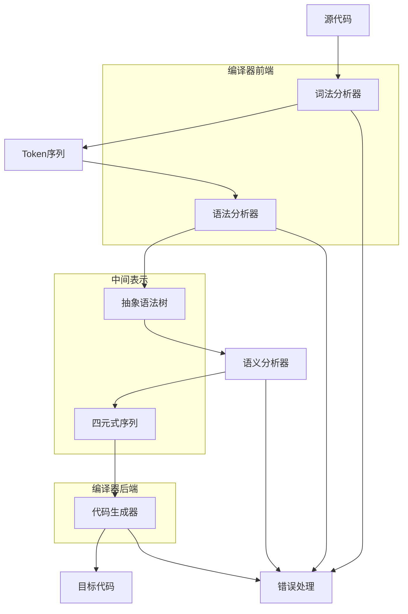

# 简单编译器数据流与核心代码讲解演讲稿

## 概述

大家好，今天我将为大家讲解我们开发的简单编译器的实现原理，重点介绍数据流和核心代码实现。这个编译器实现了从源代码到中间代码的完整编译流程，主要包括四个阶段：词法分析、语法分析、语义分析和中间代码生成。

## 1. 编译器整体架构

我们的编译器采用经典的编译原理架构，包含以下主要模块：

1. **词法分析器 (Lexer)** - 将源代码转换为Token序列
2. **语法分析器 (Parser)** - 将Token序列转换为抽象语法树(AST)
3. **语义分析器 (Semantic Analyzer)** - 进行语义检查并生成四元式中间代码
4. **代码生成器 (Code Generator)** - 将四元式转换为目标代码（可选）

## 2. 数据流说明

### 2.1 数据流流程图

```
源代码 (Source Code)
      ↓
词法分析 (Lexical Analysis)
      ↓
Token序列 (Token Sequence)
      ↓
语法分析 (Syntax Analysis)
      ↓
抽象语法树 (Abstract Syntax Tree)
      ↓
语义分析 (Semantic Analysis)
      ↓
四元式序列 (Quadruple Sequence)
      ↓
目标代码 (Target Code) [可选]
```

### 2.2 各阶段详细说明

#### 阶段1：词法分析 (源代码 → Token序列)

**输入**：源代码字符串
**输出**：Token对象序列
**处理过程**：
1. 扫描源代码字符流
2. 识别单词符号（关键字、标识符、常量、运算符、界符）
3. 生成对应的Token对象
4. 处理注释和空白字符

**示例转换**：
```c
int a = 10;
```
转换为：
```
Token(INT, 'int')
Token(IDENTIFIER, 'a')
Token(ASSIGN, '=')
Token(NUMBER, '10', value=10)
Token(SEMICOLON, ';')
```

#### 阶段2：语法分析 (Token序列 → AST)

**输入**：Token序列
**输出**：抽象语法树(AST)
**处理过程**：
1. 使用递归下降分析法
2. 根据文法规则构建语法树
3. 检查语法正确性
4. 构建层次化的AST结构

**示例AST结构**：
```
Program
├── DeclarationSequence
│   └── Declaration
│       └── IdentifierList
│           └── Identifier [a]
└── StatementSequence
    └── AssignmentStatement
        └── AssignmentExpression
            ├── Identifier [a]
            └── Number [10]
```

#### 阶段3：语义分析 (AST → 四元式)

**输入**：抽象语法树
**输出**：四元式序列
**处理过程**：
1. 构建符号表
2. 进行语义检查（变量声明、类型检查等）
3. 生成四元式中间代码
4. 处理控制流（条件、循环）

**示例四元式**：
```
(1) (=, 10, _, a)
(2) (=, a, _, t1)
(3) (+, t1, 2, t2)
(4) (=, t2, _, b)
```

### 2.3 数据流示例

让我们通过一个完整的例子来看数据流：

**源代码**：
```c
main() {
    int a, b;
    a = 1;
    b = a + 2;
}
```

**数据流过程**：

1. **词法分析输出**：
   ```
   (1, main) (41, () (42, )) (43, {) (2, int) (10, a) (46, ,) (10, b) (45, ;)
   (10, a) (25, =) (11, 1) (45, ;) (10, b) (25, =) (10, a) (21, +) (11, 2) (45, ;)
   (44, }) (99, EOF)
   ```

2. **语法分析输出**（AST简化表示）：
   ```
   Program
   ├── DeclarationSequence
   │   └── Declaration
   │       └── IdentifierList
   │           ├── Identifier [a]
   │           └── Identifier [b]
   └── StatementSequence
       ├── AssignmentStatement
       │   └── AssignmentExpression
       │       ├── Identifier [a]
       │       └── Number [1]
       └── AssignmentStatement
           └── AssignmentExpression
               ├── Identifier [b]
               └── ArithmeticExpression
                   ├── Identifier [a]
                   ├── Operator [+]
                   └── Number [2]
   ```

3. **语义分析输出**（四元式）：
   ```
   (0) (=, 1, _, a)
   (1) (+, a, 2, t1)
   (2) (=, t1, _, b)
   ```

## 3. 核心代码讲解

### 3.1 词法分析器重点讲解

#### 1. TokenType枚举类：解释各种Token类型的含义

```python
class TokenType(Enum):
    """Token类型枚举"""
    # 关键字
    MAIN = 1      # main关键字
    INT = 2       # int关键字
    IF = 3        # if关键字
    ELSE = 4      # else关键字
    WHILE = 5     # while关键字
    FOR = 6       # for关键字
    
    # 标识符和常量
    IDENTIFIER = 10  # 标识符
    NUMBER = 11      # 数字常量
    
    # 运算符
    PLUS = 21        # +
    MINUS = 22       # -
    MULTIPLY = 23    # *
    DIVIDE = 24      # /
    ASSIGN = 25      # =
    GT = 26          # >
    LT = 27          # <
    GE = 28          # >=
    LE = 29          # <=
    EQ = 30          # ==
    NE = 31          # !=
    
    # 界符
    LPAREN = 41      # (
    RPAREN = 42      # )
    LBRACE = 43      # {
    RBRACE = 44      # }
    SEMICOLON = 45   # ;
    COMMA = 46       # ,
    
    # 特殊
    EOF = 99         # 文件结束符
```

**设计要点**：
- 使用枚举类提高代码可读性
- 按类别分组（关键字、标识符、运算符、界符）
- 预留扩展空间（不同类别使用不同的数值范围）

#### 2. 正则表达式模式：展示如何匹配不同单词符号

```python
PATTERNS = [
    (r'//[^\n]*', None),               # 单行注释
    (r'/\*.*?\*/', None),              # 多行注释（非贪婪匹配）
    (r'[ \t\r]+', None),               # 空白字符（不包括换行）
    (r'\n', None),                     # 换行（单独处理以更新行号）
    (r'[0-9]+', 'NUMBER'),             # 无符号整数
    (r'[a-zA-Z][a-zA-Z0-9]*', 'ID'),   # 标识符
    (r'>=|<=|==|!=', 'OPERATOR'),      # 双字符运算符
    (r'[+\-*/=><;{},()]', 'OPERATOR'), # 单字符运算符和界符
]
```

**匹配策略**：
1. **优先级顺序**：模式列表的顺序就是匹配优先级
2. **最长匹配原则**：正则表达式会自动匹配最长的可能字符串
3. **特殊处理**：注释和空白字符匹配后直接跳过，不生成Token

#### 3. _next_token()方法：演示状态转换过程

```python
def _next_token(self) -> Optional[Token]:
    """获取下一个Token"""
    if self.position >= len(self.source):
        return None
    
    # 尝试匹配所有模式
    for pattern, token_type in self.PATTERNS:
        regex = re.compile(pattern)
        match = regex.match(self.source, self.position)
        
        if match:
            text = match.group()
            start_pos = self.position
            self.position = match.end()
            
            # 更新行号和列号
            if pattern == r'\n':
                self.line += 1
                self.column = 1
                return None
            elif pattern.startswith(r'//') or pattern.startswith(r'/\*'):
                # 注释，跳过
                newlines = text.count('\n')
                if newlines > 0:
                    self.line += newlines
                    self.column = 1
                else:
                    self.column += len(text)
                return None
            elif pattern == r'[ \t\r]+':
                # 空白字符
                self.column += len(text)
                return None
            
            # 计算Token起始列
            token_column = self.column
            self.column += len(text)
            
            # 根据Token类型创建Token
            if token_type == 'NUMBER':
                return self._create_number_token(text, token_column)
            elif token_type == 'ID':
                return self._create_identifier_token(text, token_column)
            elif token_type == 'OPERATOR':
                return self._create_operator_token(text, token_column)
    
    # 没有模式匹配，报告错误
    char = self.source[self.position]
    error_msg = f"非法字符: '{char}' (ASCII: {ord(char)})"
    self.errors.append(f"第{self.line}行第{self.column}列: {error_msg}")
    
    # 跳过非法字符并继续分析
    self.position += 1
    self.column += 1
    return None
```

**状态转换关键点**：
1. **位置管理**：维护position、line、column三个状态
2. **错误恢复**：遇到非法字符时跳过并继续分析
3. **资源清理**：正确处理注释和空白字符

#### 4. 错误处理机制：展示非法字符检测

```python
def _create_number_token(self, text: str, column: int) -> Token:
    """创建数字Token"""
    try:
        value = int(text)
        return Token(TokenType.NUMBER, text, value, self.line, column)
    except ValueError:
        error_msg = f"数字格式错误: {text}"
        self.errors.append(f"第{self.line}行第{column}列: {error_msg}")
        return Token(TokenType.NUMBER, text, 0, self.line, column)

def _create_identifier_token(self, text: str, column: int) -> Token:
    """创建标识符或关键字Token"""
    # 检查是否是关键字
    if text in self.KEYWORDS:
        return Token(self.KEYWORDS[text], text, None, self.line, column)
    else:
        # 标识符，属性值是符号表指针（暂时使用标识符名称）
        return Token(TokenType.IDENTIFIER, text, text, self.line, column)
```

**错误处理策略**：
1. **收集而非中断**：收集所有错误信息，不立即中断分析
2. **容错处理**：数字格式错误时使用默认值0
3. **位置信息**：每个错误都包含精确的行列位置

### 3.2 语法分析器重点讲解

#### 1. 递归下降分析法：解释LL(1)文法实现

**文法规则示例**：
```
<program> -> main(){<declaration_sequence><statement_sequence>}
<declaration_sequence> -> <declaration_sequence><declaration> | <declaration> | ε
<declaration> -> int <identifier_list>;
<identifier_list> -> <identifier>,<identifier_list> | <identifier>
<statement_sequence> -> <statement_sequence><statement> | <statement>
<statement> -> <if_statement> | <while_statement> | <for_statement> | <compound_statement> | <assignment_statement>
```

**递归下降实现**：
```python
def _program(self) -> ASTNode:
    """<program> -> main(){<declaration_sequence><statement_sequence>}"""
    node = ASTNode("Program")
    
    # main关键字
    if not self._consume(TokenType.MAIN, "Expected 'main' keyword"):
        return node
    
    # '('
    if not self._consume(TokenType.LPAREN, "Expected '(' after 'main'"):
        return node
    
    # ')'
    if not self._consume(TokenType.RPAREN, "Expected ')' after '('"):
        return node
    
    # '{'
    if not self._consume(TokenType.LBRACE, "Expected '{' after 'main()'"):
        return node
    
    # <declaration_sequence>
    decl_seq = self._declaration_sequence()
    if decl_seq:
        node.add_child(decl_seq)
    
    # <statement_sequence>
    stmt_seq = self._statement_sequence()
    if stmt_seq:
        node.add_child(stmt_seq)
    
    # '}'
    if not self._consume(TokenType.RBRACE, "Expected '}' at end of program"):
        return node
    
    return node
```

**LL(1)分析特点**：
1. **向前看一个Token**：通过_match()方法查看当前Token
2. **确定性分析**：每个非终结符对应一个分析方法
3. **错误恢复**：使用_consume()方法进行错误报告和恢复

#### 2. ASTNode类：展示抽象语法树结构

```python
class ASTNode:
    """抽象语法树节点"""
    def __init__(self, node_type: str, value: Any = None, children: List['ASTNode'] = None):
        self.node_type = node_type      # 节点类型
        self.value = value              # 节点值
        self.children = children if children is not None else []  # 子节点
    
    def add_child(self, child: 'ASTNode'):
        """添加子节点"""
        self.children.append(child)
    
    def __repr__(self):
        return f"ASTNode({self.node_type}, value={self.value}, children={len(self.children)})"
    
    def __str__(self):
        return self._to_string()
    
    def _to_string(self, level: int = 0) -> str:
        """转换为字符串表示"""
        indent = "  " * level
        result = f"{indent}{self.node_type}"
        if self.value is not None:
            result += f" [{self.value}]"
        
        if self.children:
            result += ":\n"
            for child in self.children:
                result += child._to_string(level + 1) + "\n"
        else:
            result += "\n"
        
        return result.rstrip()
```

**AST设计特点**：
1. **通用节点结构**：所有语法结构使用统一的节点表示
2. **层次化组织**：通过children列表实现树形结构
3. **可扩展性**：node_type字段支持多种语法结构

#### 3. _program()和_expression()方法：演示语法规则实现

**_program()方法**（已在上文展示）：
- 处理程序整体结构
- 包含main函数定义
- 管理声明序列和语句序列

**_expression()方法**：
```python
def _expression(self) -> Optional[ASTNode]:
    """<expression> -> <identifier>=<arithmetic_expression> | <boolean_expression>"""
    # 先尝试赋值表达式
    if self._match(TokenType.IDENTIFIER):
        # 向前看下一个Token是否是'='
        next_pos = self.position + 1
        if next_pos < len(self.tokens) and self.tokens[next_pos].type == TokenType.ASSIGN:
            node = ASTNode("AssignmentExpression")
            
            # 标识符
            id_node = ASTNode("Identifier", self.current_token.value)
            node.add_child(id_node)
            self._advance()
            
            # '='
            self._advance()  # 消耗'='
            
            # <arithmetic_expression>
            arith_expr = self._arithmetic_expression()
            if arith_expr:
                node.add_child(arith_expr)
            
            return node
    
    # 如果不是赋值，尝试布尔表达式
    return self._boolean_expression()
```

**表达式处理策略**：
1. **多义性解决**：通过向前看技术区分赋值和布尔表达式
2. **递归结构**：表达式可能包含子表达式
3. **错误容忍**：方法返回Optional类型，允许返回None

#### 4. 错误恢复机制：展示语法错误处理

```python
def _consume(self, expected_type: TokenType, error_msg: str = "") -> bool:
    """消耗期望类型的Token，如果不匹配则报告错误"""
    if self._match(expected_type):
        self._advance()
        return True
    else:
        if not error_msg:
            error_msg = f"Expected {expected_type.name}, got {self.current_token.type if self.current_token else 'EOF'}"
        self.errors.append(f"Syntax error at line {self.current_token.line if self.current_token else '?'}: {error_msg}")
        return False
```

**错误恢复策略**：
1. **预期Token匹配**：使用_consume()而非_advance()
2. **错误收集**：收集所有错误而非立即中断
3. **同步恢复**：在关键位置（如语句边界）尝试重新同步
4. **错误信息丰富**：包含行号、期望内容、实际内容

## 4. 总结

### 4.1 编译器设计亮点

1. **模块化设计**：各阶段清晰分离，便于测试和维护
2. **错误恢复能力**：每个阶段都有完善的错误处理机制
3. **可扩展性**：易于添加新的语法特性或优化功能
4. **教学价值**：代码结构清晰，适合学习编译原理

### 4.2 实际应用价值

1. **理解编译过程**：通过实现加深对编译原理的理解
2. **代码生成基础**：四元式为后续代码生成提供良好基础
3. **错误处理实践**：学习编译器级别的错误处理技术
4. **软件工程训练**：模块化设计和接口设计的最佳实践

### 4.3 流程图辅助说明

为了更直观地展示数据流，我们可以使用以下流程图：



**流程图说明**：

1. **数据流方向**：从上到下，从左到右
2. **模块划分**：
   - **前端**：词法分析、语法分析（与源语言相关）
   - **中间表示**：AST和四元式（语言无关）
   - **后端**：代码生成（与目标机器相关）
3. **错误处理**：各阶段都可能产生错误，统一处理
4. **数据传递**：每个阶段的输出是下一阶段的输入

### 4.4 时间分配建议（5分钟讲解）

根据演讲要求，核心代码讲解部分建议按以下时间分配：

1. **词法分析器重点讲解**（2分钟）
   - TokenType枚举类：30秒
   - 正则表达式模式：30秒
   - _next_token()方法：40秒
   - 错误处理机制：20秒

2. **语法分析器重点讲解**（2分钟）
   - 递归下降分析法：40秒
   - ASTNode类：30秒
   - _program()和_expression()方法：40秒
   - 错误恢复机制：10秒

3. **数据流总结**（1分钟）
   - 整体流程回顾：30秒
   - 实际应用价值：30秒

## 5. Q&A准备

### 5.1 可能的问题及回答

**Q1：为什么选择递归下降分析法而不是其他分析方法？**
A：递归下降分析法实现简单直观，适合教学目的。它直接对应文法的产生式，代码可读性好，便于理解和修改。

**Q2：四元式相比其他中间表示有什么优势？**
A：四元式形式统一，易于生成和优化。每个四元式包含操作符和三个操作数，适合表示各种运算和控制流。

**Q3：如何处理更复杂的语法特性（如函数调用、数组）？**
A：当前编译器设计为可扩展的。可以：
   1. 扩展TokenType枚举
   2. 添加新的文法规则
   3. 实现对应的分析方法
   4. 扩展语义分析逻辑

**Q4：错误恢复机制如何避免级联错误？**
A：我们采用以下策略：
   1. 在关键位置（如语句边界）尝试重新同步
   2. 收集错误而非立即中断
   3. 提供详细的错误位置信息
   4. 跳过非法Token继续分析

### 5.2 演示建议

1. **现场演示**：运行编译器处理示例代码
2. **逐步展示**：展示每个阶段的输出
3. **错误演示**：故意引入错误展示错误处理能力
4. **对比展示**：展示不同复杂度代码的编译结果

## 6. 参考资料

1. **编译器代码文件**：
   - `lexer.py` - 词法分析器实现
   - `parser.py` - 语法分析器实现
   - `semantic.py` - 语义分析器实现
   - `codegen.py` - 代码生成器实现
   - `main.py` - 主程序入口

2. **测试文件**：
   - `simple_test.c` - 简单测试用例
   - `test_complex.c` - 复杂测试用例
   - `test_for.c` - 循环测试用例

3. **文档文件**：
   - `language_spec.md` - 语言规范
   - `USAGE.md` - 使用说明
   - `RUN.md` - 运行指南

## 7. 结束语

通过这个简单编译器的实现，我们深入理解了编译器的核心原理和实现技术。从词法分析到中间代码生成，每个阶段都有其独特的设计考虑和技术挑战。

这个项目不仅是一个功能完整的编译器，更是一个优秀的学习工具，帮助我们掌握：
- 编译原理的核心概念
- 软件工程的模块化设计
- 错误处理和恢复技术
- 代码生成和优化基础

希望这个讲解能帮助大家更好地理解编译器的工作原理，并为后续的编译器学习和开发打下坚实基础。

谢谢大家！
